# Screens and displayed values

The OLED is 128 x 64 pixels with an 8 x 8 font, so a line holds 16 characters and the screen about 7 lines
(Main, Speed and the Wi-Fi password use a larger font). This document lists every page, what each value means and where it
comes from. The drawing code is `screens.py`; the menu is `menu.py`.

The pictures in this document are rendered by [`tools/screenshots.py`](../tools/screenshots.py) with the same drawing
code and fonts as the board, from made-up data (`python3 tools/screenshots.py` regenerates them). The text sketches
beside them show what each line is.

## Navigation

The pages are in two loops. The **main loop** is what you look at under way: **Main, Speed, GPS, Anchor**, the
**MOB** page while a man-overboard mark exists and, while the Wi-Fi access point is on, **Wi-Fi**. The **debug loop** holds the pages with the details: **Alerts,
Stats, Satellites, Signal, Spoofing, System, Debug**.

| Key | On a page | In the menu |
|---|---|---|
| UP short | next page of the loop | previous item / increase value |
| DN short | previous page of the loop | next item / decrease value |
| UP long (1 s) | nothing | select / confirm |
| DN long (1 s) | back to Main; **on Main: open the menu**; in the debug loop: leave it | back / cancel / leave the menu |
| UP long (1 s) on **Anchor** / **MOB** | drop or raise the anchor / clear the mark (the latter after a question) | select / confirm |
| UP held 3 s | Wi-Fi access point on/off | treated as a normal long press |
| **DN held 3 s** | **man overboard**: mark the position | man overboard too (the menu closes) |
| **UP and DN together, 2 s** | switch between the main loop and the debug loop | nothing |

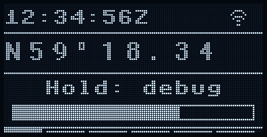

**Two keys together.** While both keys are held for more than about 0.4 s a box appears (`Hold: debug`, or
`Hold: main` in the debug loop) with a progress bar that fills over the 2 s; the loop switches when it is full. While
both keys are down neither of them acts on its own (that includes the 3 s Wi-Fi toggle on UP), even if you let go
early. In the debug loop a long DN also leaves it, so does two minutes without a key press, and a new `MEDIUM`/`HIGH`
alert (or one that gets worse) sends you back to the Main page so that the banner is seen. The screen can switch itself off after a timeout (menu Display > Screen off); the first
key press only wakes it, and a jamming or spoofing alert wakes it and keeps it on. Pages are redrawn when a visible
value changes (and at least every 500 ms when something did).

**Sound.** With a buzzer on the pin `PIN_BUZZER` (set in `main.py`; none by default) an alert beeps: a short beep every 3 s for `MEDIUM`, two beeps a second for `HIGH`, rapid beeping for an anchor alarm or man overboard. Any key press silences it until the alert gets worse (an anchor alarm that goes on sounds again after 30 s). Menu Detection > Buzzer switches it off.

**On every page**, the bottom edge carries a page indicator: one segment per page of the loop you are in, two
pixels high for the page you are on. In the debug loop the segments are dashed.

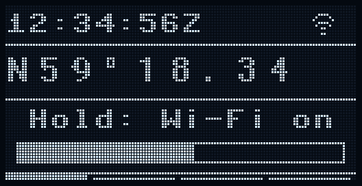

**Wi-Fi gesture feedback.** While UP is held on its own for more than about 0.4 s a box appears: `Hold: Wi-Fi on`
(or `off`, whichever the release will switch to) with a progress bar that fills over the 3 s; at full it reads
`Release now!`. The Wi-Fi page itself is in the main loop only while the access point is on (or failed to start).

**Alert banner and blink.** The detectors report the probability of spoofing and of jamming as `OK`, `LOW`,
`MEDIUM` or `HIGH`; `MEDIUM` and `HIGH` are alerts. An alert replaces the top row of the Main and
Speed pages with a white bar showing it (`SPOOFING HIGH`, `JAMMING MEDIUM`, or `SPF! JAM?` for both, the mark standing for the level: `?` medium, `!` high); the indicator codes are on the Spoofing and Signal pages, and the display
blinks (inverted) for 3 s when the alert starts. The first key press on one of those pages dismisses the banner and
the blink (it does not change the page); the small labels stay. A new alert, or one that gets worse (`MEDIUM` to `HIGH`), shows the banner and the blink again.
`LOW` is not an alert: it only shows the small label (`SPF.` / `JAM.`) and does not keep the screen on.

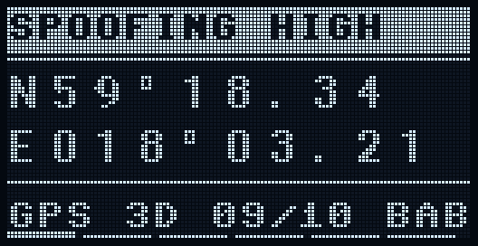

## 1. Main

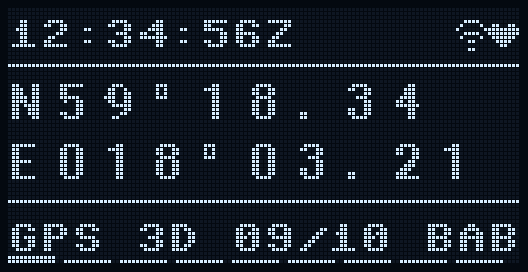

```
12:34:56Z  S? ))) <3     <- UTC time, label, Wi-Fi icon, heartbeat icon
-------------------------
N59°12.34                <- latitude  (large font)
E018°03.21               <- longitude (large font)
-------------------------
GPS 3D 9/14        BBB   <- fix, mode, satellites used/in view, DOP letters
```

| Item | Meaning |
|---|---|
| Time | The last RMC/GGA/ZDA time field, `hh:mm:ss`, followed by `Z` for UTC or `L` when the clock is shifted to local time (menu Display > UTC offset, -12 to +14 hours); `--:--:--` until a time has been received. |
| Heartbeat icon (last column) | Shows that position sentences (RMC/GGA) are reaching the radio. A **filled heart** for 0.35 s after each sentence was written to the radio and an **outline heart** in between, so it beats once per fix. A **short bar** means nothing was forwarded for 3 s (no data, no fix, the types switched off in the menu, or blocked by a spoofing alert in block mode). A **cross** means the radio write failed, or a position sentence was dropped for being more than 3 s late; it stays for 10 s. It shows that the bridge wrote to the radio, not that the radio received it. |
| Jamming label | The probability of jamming, only when it is above `OK`: `JAM.` (low), `JAM?` (medium), `JAM!` (high). Blank when the detector is off, learning, or `OK`. See [jamming-detection.md](jamming-detection.md). |
| Spoofing label | The probability of spoofing, only when it is above `OK`: `SPF.` (low), `SPF?` (medium), `SPF!` (high). Blank when `OK` or the detector is off. See [spoofing-detection.md](spoofing-detection.md). |
| Wi-Fi icon | Only while the access point is on: the **Wi-Fi arcs** (followed by `!` if the access point failed to start). The number of clients is on the Wi-Fi page. |
| Label space | The labels and the Wi-Fi icon share five character cells, right-aligned before the heartbeat icon. When they do not fit, the labels shrink (`SPF?` to `S?`, `JAM!` to `J!`), and if that is not enough the Wi-Fi icon is dropped. |
| Latitude / longitude | Hemisphere letter, whole degrees, decimal minutes always with two digits before the point and two after: `N59°12.34`, `E018°03.21`. With menu Display > Coords set to `dd.dddd` it is decimal degrees instead: `N59.3057°`, `E018.0537°`. Replaced by `NO FIX` when there is no usable position. |
| `NO FIX` | Shown when the last GGA says no fix, no position sentence has arrived yet, or the last position sentence is older than 10 s. Under it `lost m:ss` (or `lost 1h02m`) counts the time since the last valid fix; nothing is shown if there has been no fix since boot. |
| Waiting for the first fix | Before the first fix since boot the page shows `Waiting for fix`, the satellites tracked / in view and how long it has taken (`waited m:ss`, updated every second); a cold start can take several minutes. A fix lost later shows `NO FIX` instead. |
| Waiting for the first fix | Before the first fix since boot the page shows `Waiting for fix`, the satellites tracked / in view and how long it has taken (`waited m:ss`, updated every second); a cold start can take several minutes. A fix lost later shows `NO FIX` and `lost m:ss` instead. |
| Alert banner | While an alert (`MEDIUM` or `HIGH`) is active and not dismissed, the time/label row is replaced by a white bar with the alert text (see Navigation). |
| Fix | Last GGA fix quality: `NO`, `GPS`, `DGPS` (differential/SBAS) or `?`. |
| Mode | From GSA: `2D`, `3D`, or blank when unknown. |
| `used/view` | Satellites used in the solution (GGA) / satellites in view (sum of the GSV totals of all systems). |
| DOP letters (right) | Three letters for PDOP, HDOP, VDOP, each classified: `A` < 1 (ideal), `B` 1-2 (excellent), `C` 2-5 (good), `D` 5-10 (moderate), `E` 10-20 (fair), `F` >= 20 (poor), `?` unknown. |

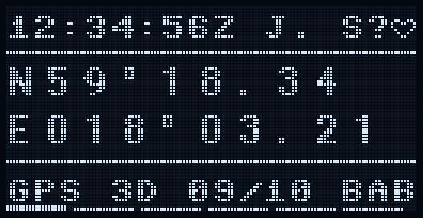

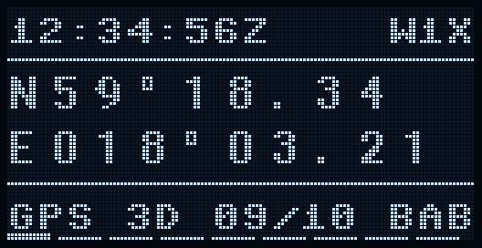

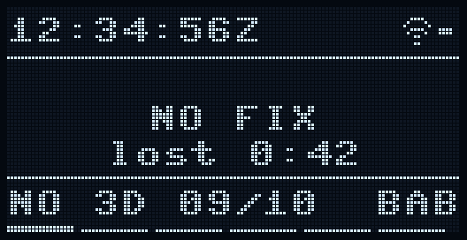

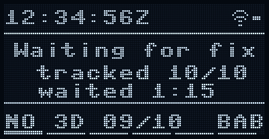

## 2. Speed

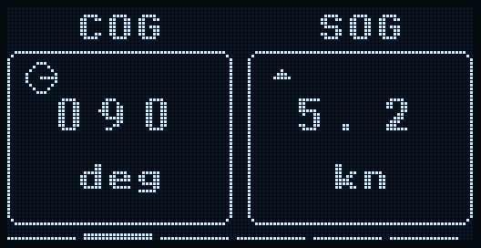

```
   COG         SOG       <- titles
.-------.   .-------.
|       |   |       |
|  124  |   |  5.2  |    <- values (large font)
|       |   |       |
|  deg  |   |   kn  |    <- units
'-------'   '-------'
```

| Item | Meaning |
|---|---|
| COG (left) | Course over ground in degrees (000-359) from the last RMC. `---` without a fix, when the speed is below 0.5 kn (the course of a nearly stationary receiver is noise) or when the module reports none. The small ring in the corner has a needle pointing along the course (north is up); it is absent while the course is `---`. |
| SOG (right) | Speed over ground from the last RMC in the unit chosen in menu Display > Speed unit (`kn`, `km/h` or `m/s`), one decimal (none from 100 up). `--` without a fix. The small mark in the corner compares the speed with 10 s ago: a triangle pointing up when it rose by 0.5 kn or more, pointing down when it fell by that much, a short bar when it is steady; nothing for the first ten seconds. |

The alert banner replaces the title row, as on the Main page:

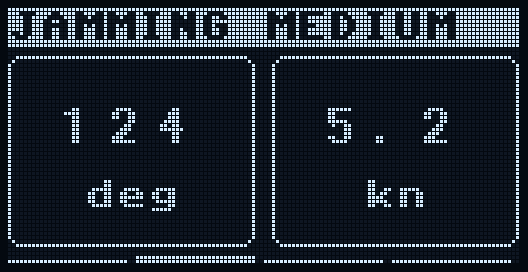

## 3. GPS

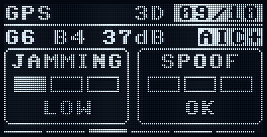

```
GPS               3D [9/14]  <- title, fix mode, satellites used / in view (badge)
G6 B4 41dB          [AIC+]   <- satellites used per system, mean C/N0, interference-cancellation tag
.-----------.  .-----------.
|  JAMMING  |  |   SPOOF   |
| [#][ ][ ] |  | [ ][ ][ ] |  <- three steps light up with the probability
|    LOW    |  |    OK     |
'-----------'  '-----------'
```

The overview you want under way: how healthy the sky is, and how likely jamming and spoofing are.

| Item | Meaning |
|---|---|
| title right, badge | Fix mode (`2D`/`3D`, or the fix quality while the mode is unknown) and satellites used in the solution / in view. |
| `G<n> B<n>` | Satellites used from GPS and BeiDou (from GSA). |
| `<n>dB` | Mean C/N0 of all tracked satellites; `--` when none are tracked. |
| `AIC` tag | The module's interference cancellation: a lit (white) `AIC+` when it acknowledged being on, an outlined `AIC-` when it refused, `AIC?` when it has not answered. |
| `JAMMING` / `SPOOF` gauges | The probability of jamming and of spoofing: no step lit and `OK`; one step `LOW`; two steps `MEDIUM`; three steps `HIGH`. `INIT` while the jamming baseline is being learned, `off` when the detector is disabled. A `MEDIUM` or `HIGH` gauge is filled solid, because it is an alert. The reasons are in the debug loop (Signal and Spoofing pages). |

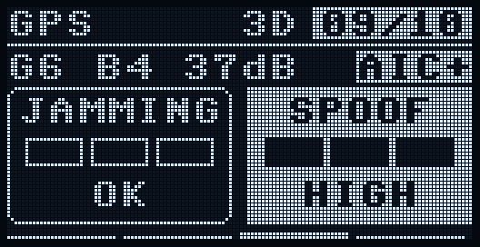

## 4. Anchor

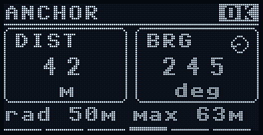

```
ANCHOR                [OK]  <- title and state badge (OFF, OK, DRAG, NO FIX)
.----------.  .----------.
| DIST     |  | BRG   (o)|    <- distance from the anchor, bearing of the boat seen from it
|   42     |  |   245    |
|    m     |  |   deg    |
'----------'  '----------'
rad 50m max 63m              <- alarm radius, the furthest it has been since the anchor was dropped
```

The anchor watch is for the boat at anchor: a long UP (1 s) on this page **drops the anchor at the current
position**, and from then on the boat's distance and bearing from that point are shown. The position is stored
in a file (`anchor.json`), so a reboot or a power cut does not end the watch.

| Item | Meaning |
|---|---|
| badge | `OFF` (no anchor), `OK`, `DRAG` (alarm: the boat has been outside the radius for three fixes in a row; a single stray fix is ignored), `NO FIX` (alarm: no valid fix for 2 minutes, so the watch cannot see anything). |
| `DIST` | Distance from the anchor position, in metres up to 999 m, then nautical miles (speed unit knots) or kilometres. |
| `BRG` | True bearing of the boat seen from the anchor, with a small compass needle: where it has dragged to. |
| bottom line | The alarm radius (menu Anchor > Radius, 10-500 m, default 50 m) and the largest distance so far. |

A long UP on this page again **raises the anchor** after a confirmation (`UP long = yes`, any other key or ten
seconds without an answer means no). An alarm raises the banner `ANCHOR DRAG` or `ANCHOR NO FIX` on the Main and
Speed pages, blinks the display, keeps the screen on, adds an `ANC!` entry to the Alerts page and sounds the buzzer
(rapid beeping). A key press silences the buzzer and the banner for 30 s; if the boat is still dragging they come
back. The alarm ends by itself when the boat is back inside the radius for three fixes.

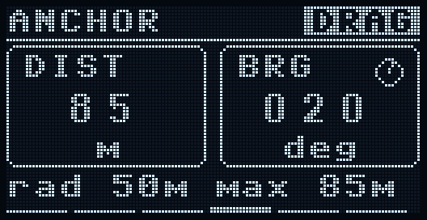

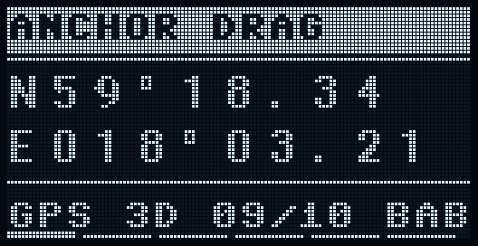

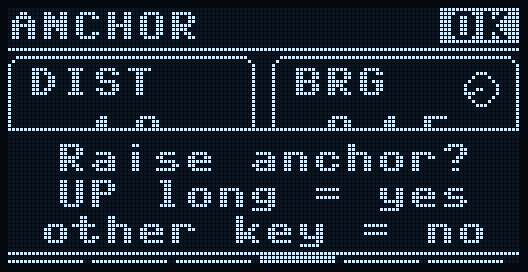

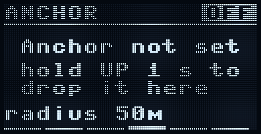

## 5. Man overboard

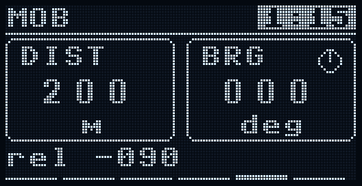

```
MOB                  [1:15]  <- title, time since the mark
.----------.  .----------.
| DIST     |  | BRG   (o)|    <- distance and bearing from the boat to the mark
|   200    |  |   000    |
|    m     |  |   deg    |
'----------'  '----------'
rel -090                     <- bearing relative to the course
```

Hold **DN for 3 s** on any page (a box `Hold: MOB` with a progress bar appears after 1.2 s) and the current position is
marked, the display jumps to this page, the banner `MAN OVERBOARD` shows with the blink, the buzzer sounds (rapid) and
an `MOB!` entry goes to the Alerts page. The gesture works with the screen off, in the menu and in the debug loop,
and does nothing without a position (`No position yet`). The first key press acknowledges the banner and the buzzer;
the mark stays and the page stays in the main loop until you clear it.

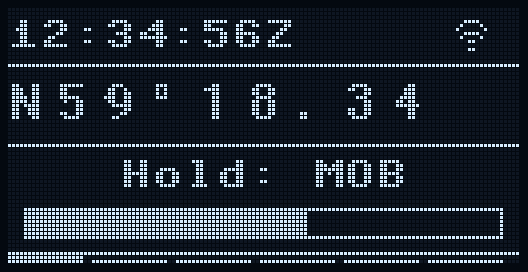

| Item | Meaning |
|---|---|
| badge | Minutes and seconds since the mark. |
| `DIST` / `BRG` | Distance from the boat to the marked position and the true bearing to steer, with a compass needle. |
| `rel` | The bearing relative to the course over ground: `-090` means 90 degrees to port, `+045` 45 degrees to starboard; `---` while the boat is not moving (no course). |

A long UP on this page **clears the mark** after a confirmation. Marking again while a mark exists only shows it
(`MOB already marked`).

## 6. Wi-Fi

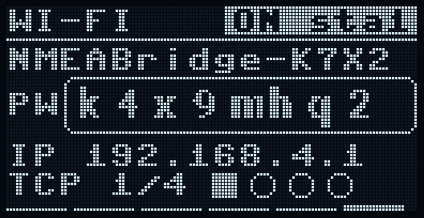

```
WI-FI         [ON sta0]  <- title and state badge
NMEABridge-AB12
PW [ k4x9mhq2 ]          <- the password in the large font
IP 192.168.4.1
TCP 1/4 [#][ ][ ][ ]     <- clients / maximum, one square per slot (filled = connected)
```

| Item | Meaning |
|---|---|
| badge | `OFF`, `ON sta<n>`, or `ERR` (the access point could not start). Off after every boot. `sta<n>` is the number of phones associated with the access point at the Wi-Fi level, before any TCP connection: if a join attempt fails but this number briefly shows 1, the phone reached the radio and failed later (address or password stage). |
| SSID | Network name: `NMEABridge-` plus four characters derived from the board ID. |
| `PW` | The WPA2 password (8 characters, no look-alike characters such as `0/o` or `1/l`), in the large font. Generated on first boot and stored; menu Wi-Fi > New password makes a new one. A password of your own longer than 8 characters is shown in the small font (13 characters at most). A phone that saved the network with an older password must forget it first. |
| `IP` | The access point's address (`-` while off). Connect clients to this address, TCP port 10110 (or receive UDP broadcasts on that port). |
| `TCP n/m` | Connected TCP clients / maximum, with one square per slot. The Main page only shows that the access point is on, not the number of clients. |

## 7. Alerts

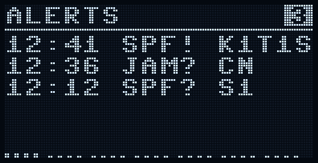

```
ALERTS                [3]  <- title, alerts since boot (badge)
12:41 SPF! K1T1S         <- time, label, reason
12:36 JAM? CN
12:12 SPF? S1
```

The first page of the debug loop: the last five alerts, newest first, so that you can read what the banner no longer
spells out. An entry is added when the spoofing or jamming probability reaches `MEDIUM` or `HIGH`, and again when
it gets worse; `LOW` is not an alert. The list is in memory (ten entries) and is empty after a reboot. `none since
boot` when there has been none.

| Item | Meaning |
|---|---|
| time | Hour and minute of the clock (UTC, or local time if menu Display > UTC offset is set); `--:--` before the first time is received. |
| label | `SPF` (spoofing) or `JAM` (jamming) followed by `?` (medium) or `!` (high). |
| reason | The indicator codes: `K1 T1 K2 S1 C1 K3 S2 S3` for spoofing (see the Spoofing page), `C N F M` for jamming (cn0, sat, fix, mod), cut to what fits. |
| badge | The number of alerts since boot, also those that have scrolled out of the list. |

## 8. Stats

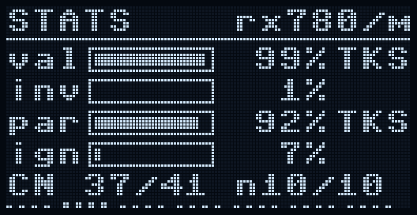

```
STATS             rx58/m <- title, sentences per minute  (an inverted "d3" badge shows dropped sentences)
val [|||||||| ]  99% TKS <- bar and share of received sentences that were valid, last valid type
inv [         ]   1%
par [|||||||| ]  92% TKS <- parsed ones, and the last parsed type
ign [|        ]   7%     <- ignored ones, and the last ignored type
CN 41/40 n12/12          <- C/N0 now/baseline, tracked satellites now/baseline
```

The bars and percentages are over a 10-second window of everything the GPS thread framed, refreshed every 10 s.

| Item | Meaning |
|---|---|
| `rx<n>/m` | Sentences received per minute (from the 10 s window; `9999+` if larger). It is hidden while the `d` badge is shown and the two do not fit together. |
| `d<n>` badge | Only appears when sentences were dropped because the queue between the GPS thread and the main loop was full (since boot; `d99+` at most). Normally absent. |
| `val` | Sentences with a correct checksum and structure. |
| `inv` | Sentences with a bad checksum or broken framing. A few at start-up or after reconnecting are normal; a steady stream means a wrong baud rate or a noisy line. |
| `par` | Valid sentences whose type the bridge decodes (RMC, GGA, GSA, GSV, ZDA, PMTK acks, ...). |
| `ign` | Valid sentences of a type the bridge does not decode (still forwarded if the type is enabled in the menu). |
| type at the right | Three-letter type of the most recent sentence in that category. |
| `CN a/b nc/d` | Only while jamming detection is on. `a` mean C/N0 of the tracked satellites now, `b` the learned baseline mean, `c` satellites tracked now, `d` baseline satellite count. |

## 9. Satellites

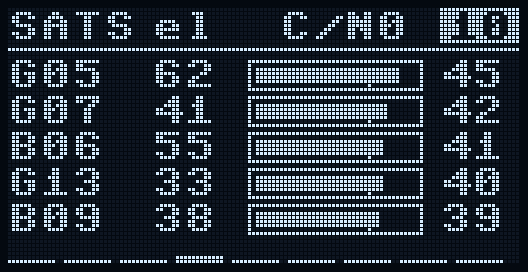

```
SATS el  C/N0      [10]  <- title, column titles, number of satellites tracked (badge)
G05  62 [|||||||||]  45  <- id, elevation, gauge, C/N0
B21  17 [||||||    ]  29
```

The five strongest tracked satellites (C/N0 > 0), strongest first. `no satellites` when none are tracked.

| Column | Meaning |
|---|---|
| badge | Number of tracked satellites (all of them, not just the five shown). |
| id | `G` = GPS, `B` = BeiDou, followed by the PRN/satellite number. |
| `el` | Elevation in degrees above the horizon; `--` when the module does not report it. |
| gauge | Outlined bar proportional to C/N0 (full = 50 dB-Hz or more); the small tick on its lower edge marks 35 dB-Hz, a typical healthy level. |
| number | C/N0 (signal-to-noise density) in dB-Hz. Typical open-sky values are 35-50. |

## 10. Signal (jamming indicator)

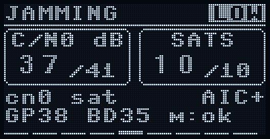

```
JAMMING        [MEDIUM]  <- title and probability badge
.----------.  .----------.
|  C/N0 dB |  |   SATS   |
|  37 /41  |  |  10 /10  |  <- now (large) and learned baseline (small)
'----------'  '----------'
cn0 sat           AIC+   <- indicators that fire, interference cancellation
GP38 BD35 m:ok           <- mean C/N0 per constellation, the module's own verdict
```

The page shows `off` in the badge (and nothing else) when the detector is disabled (menu Detection > Jamming).

| Item | Meaning |
|---|---|
| badge | `INIT` (learning the baseline, no verdict yet), `OK`, `LOW`, `MEDIUM`, `HIGH`: the probability of jamming. `MEDIUM` and `HIGH` are alerts. |
| `C/N0 dB` panel | Current mean C/N0 of the tracked satellites (large) and the learned baseline (`/41`). |
| `SATS` panel | Tracked satellites now (large) and the baseline (`/10`). |
| reason line | Words for the indicators that were true at the last evaluation: `cn0` (mean C/N0 dropped), `sat` (fewer satellites tracked), `fix` (no fix although many satellites are in view), `mod` (module reports interference). `no issue` when none. |
| `AIC` | Active interference cancellation: `+` module acknowledged it as on, `-` refused, `?` no answer yet. |
| `GP.. BD..` | Mean C/N0 of the GPS and BeiDou satellites separately; `-` if that system is not tracked. |
| `m:` | The L76B's own jamming detector (`$PMTKSPF`): `?` unknown, `ok`, `warn`, `CRIT`. |

## 11. Spoofing

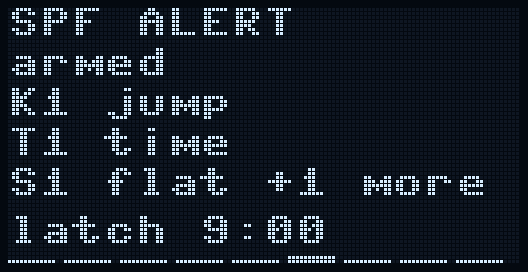

```
SPOOFING         [HIGH]  <- title and probability badge
[K1 ][T1 ][K2 ][S1 ]     <- one tile per indicator, lit (inverted) while it counts
[jmp][tim][spd][flt]
[C1 ][K3 ][S2 ][S3 ]
[g/b][alt][elv][pwr]
armed       latch 9:41   <- warm-up progress or "armed", HIGH hold-off countdown
```

The badge shows `off` (and nothing else) when the detector is disabled.

| Item | Meaning |
|---|---|
| badge | The probability of spoofing: `OK`, `LOW` (one weak indicator), `MEDIUM` (alert: one medium or two weak indicators) or `HIGH` (alert: a strong indicator or two medium ones). |
| tiles | A lit (white) tile is an indicator currently counting (younger than 60 s). `K1 jmp` position jump, `T1 tim` GPS time step, `K2 spd` movement not explained by speed, `S1 flt` uniform C/N0 ("flat"), `C1 g/b` GPS vs BeiDou level offset changed, `K3 alt` altitude step, `S2 elv` C/N0 unrelated to elevation, `S3 pwr` power rise / satellite change. |
| `armed` / `warm n/N` | After boot the detector only learns for the first N valid fixes (menu Advanced > Warm-up, default 30); no indicator can fire during warm-up. |
| `latch m:ss` | Once `HIGH` was reached it stays for 10 minutes after the last strong evidence (menu Advanced > Latch min); this is the time left. |

Details of each indicator: [spoofing-detection.md](spoofing-detection.md).

## 12. System

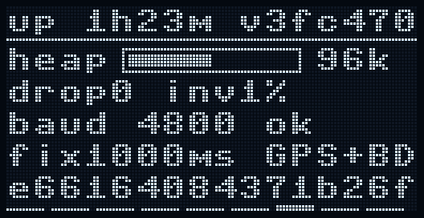

```
up 1h23m         v3fc470 <- uptime, software version (shortened to fit)
heap [|||||     ] 96k    <- free memory
drop0 inv0%
baud 4800 ok
fix1000ms GPS+BD
0123456789abcdef         <- board id (or the error counters, see below)
```

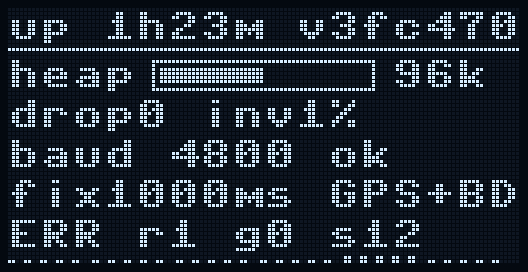

| Line | Meaning |
|---|---|
| `up` | Time since boot (hours, minutes). |
| `v...` | Software version from `git describe` at deploy time (`-dirty` = uncommitted changes, `dev` = no git), cut to the room left on the line. |
| `heap` | Free MicroPython memory in KiB, measured after a garbage collection every 3 s and rounded down to 4 KiB; the bar is relative to the 192 KiB the Pico W has. If it keeps falling, report it. |
| `drop` / `inv` | Dropped sentences (capped at `999`) and the share of invalid sentences in the last window (capped at 100). |
| baud line | `baud 4800 ok`: module already at the configured rate. `b4800<9600`: the module was found at 9600 and switched to 4800. `baud 4800 ?`: no module was heard (check wiring/power; the bridge keeps looking). |
| `fix..ms <gnss>` | Configured fix interval and GNSS mode (`GPS` or `GPS+BD`). |
| last line | First 16 hex digits of the board's unique ID (the Wi-Fi name suffix is derived from it). It is replaced by `ERR r<n> g<n> s<n>` as soon as any of these counters is non-zero (each capped at `99+`): `r` radio write failures, `g` failures contained in the optional parts (detectors, Wi-Fi, logging, ...), `s` position sentences dropped because a stall made them too old. They are all zero in normal operation; see `errors` in `bridge.py`. |

## 13. Debug

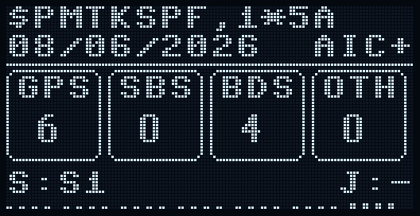

```
$GNGGA,123456.00         <- start of the last valid sentence
08/06/2026       AIC+    <- date, interference cancellation status
.-----..-----..-----..-----.
| GPS || SBS || BDS || OTH |
|  6  ||  0  ||  4  ||  0  |   <- satellites used, per system (GSA)
'-----''-----''-----''-----'
S:K1T1S1             J:CN
```

| Item | Meaning |
|---|---|
| Top line | First 16 characters of the last checksum-valid sentence. |
| Date | `dd/mm/yyyy` from the last ZDA sentence. |
| `AIC+/-/?` | As on the Signal page. |
| `GPS`, `SBS`, `BDS`, `OTH` | Satellites used in the solution, per system, from GSA: GPS, SBAS, BeiDou, other. |
| `S:` | Reason string of the spoofing detector (first 6 characters; `-` when none), only when it is on. |
| `J:` | Reason letters of the jamming detector (`C` cn0, `N` sats, `F` fix, `M` module; `-` when none), only when it is on. |

## Menu

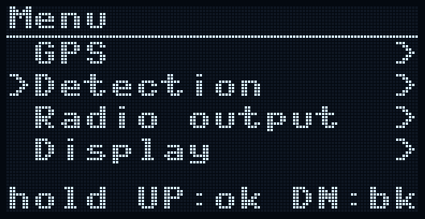

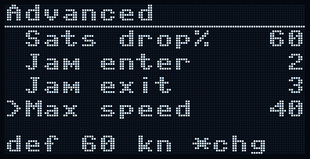

Opened with a long DN press on the Main page; leaves with a long DN press at the top level (or after 60 s without a key,
which also reverts an unconfirmed edit). The title row shows the current submenu and `*reboot` when a changed setting needs a
reboot; items marked `*` after the label are applied only at the next boot. The bottom line shows the key hints, or
`save failed` when the settings file could not be written.

| Submenu | Items |
|---|---|
| GPS | Baudrate*, GNSS mode* |
| Detection | Jamming, Spoofing, Spoof act. (`display` / `block`), Buzzer (on/off; only has an effect when a buzzer is wired and `PIN_BUZZER` is set in `main.py`) |
| Radio output | RMC, GGA, GSA, GSV, ZDA (which sentence types go to the radio) |
| Anchor | Radius (10-500 m, step 10) |
| Display | Contrast, Screen off (`never`, `30s`, `60s`, `5m`), Night mode (`off`, `auto`, `on`), Speed unit (`kn`, `km/h`, `m/s`), Coords (`ddmm.mm`, `dd.dddd`), UTC offset (-12 to +14 h) |
| Wi-Fi | Wi-Fi now (on/off), New password |
| Advanced | Detector thresholds: CN0 drop, Sats drop%, Jam enter, Jam exit, Max speed, Time jump, Flat C/N0, Alt step, Latch min, Warm-up, S2 corr, S2 cycles |
| System | Log raw, Reset defaults, Reboot now |

**Night mode** has three settings. `on` forces the dimmest contrast (0) whatever the Contrast setting says and switches
the screen off after 30 s without a key press (or sooner if Screen off is set shorter). `auto` only dims, and only
after sunset: every 10 s it works out from the GPS position and time where the sun is, dims when it is more than 3
degrees below the horizon and goes back to the Contrast setting when it is higher than 1 degree below (so it does not
flicker at dusk); without a fix it keeps its last answer. `off` leaves the display alone. A jamming, spoofing, anchor
or man-overboard alert still wakes the screen and keeps it on. Contrast 0 is the dimmest the display can be, and it is
also the default, so night mode makes a difference only after you have raised Contrast.

In Advanced the bottom line shows the default of the highlighted threshold with its unit (`def 6 dB`), followed by
`*chg` when you have changed it; other submenus and the edit mode show the key hints.

The advanced thresholds are explained in the two detection documents.
